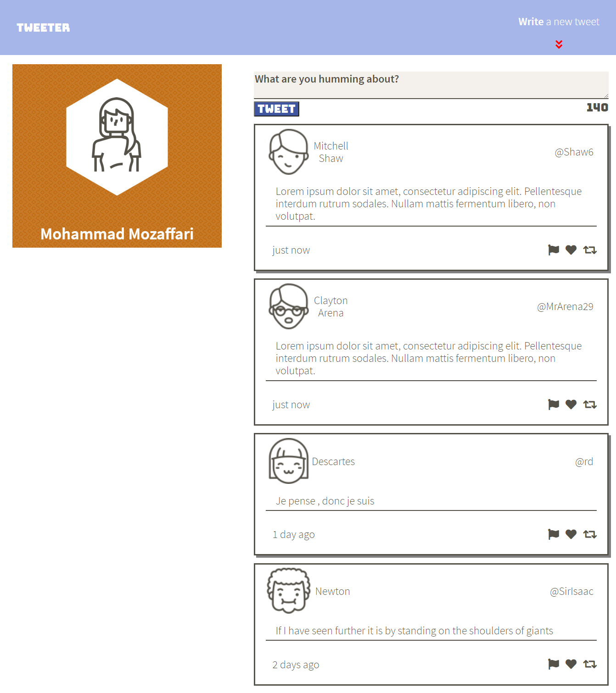
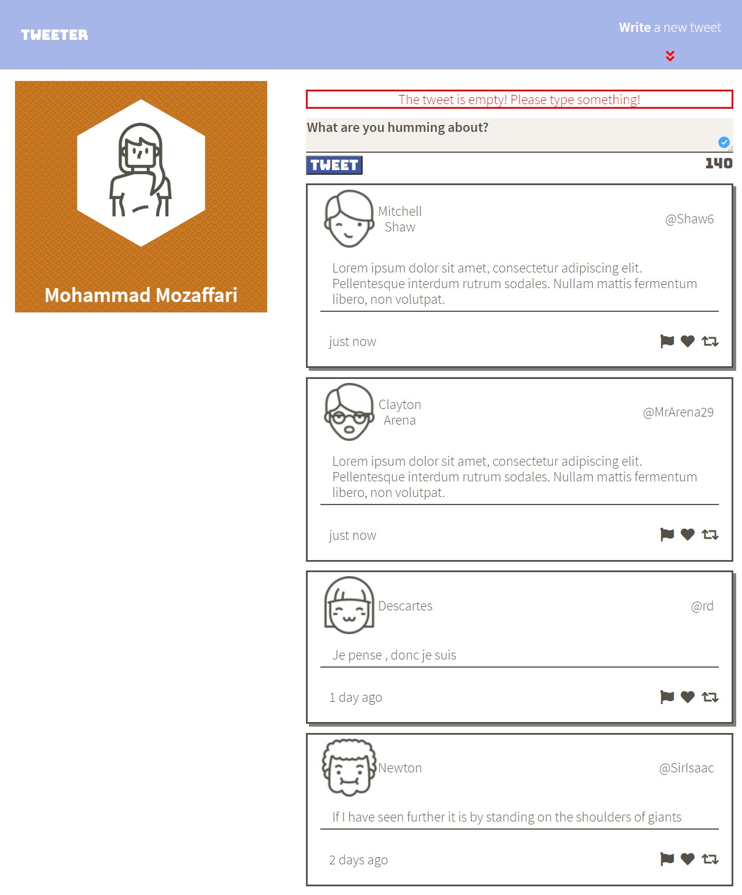
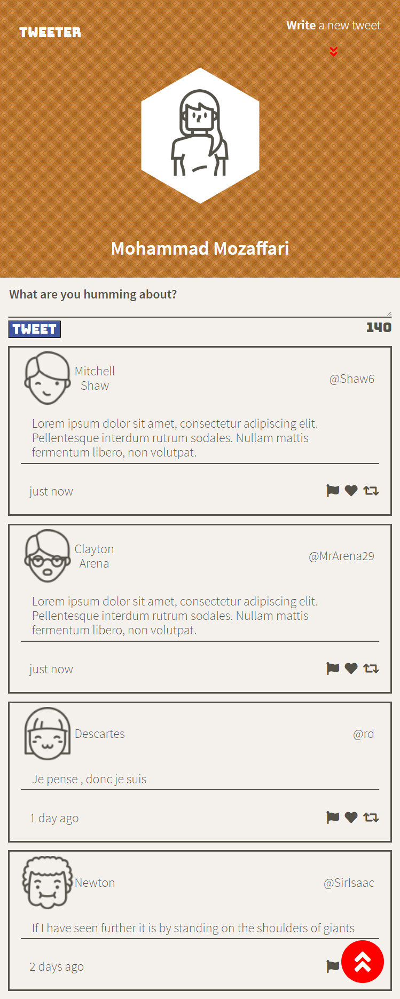

# Tweeter Project

Tweeter is a simple, single-page Twitter clone.

## Final Product

### Desktop Mode - Highlighted item

When hovering over a Tweet, put emphasis on it.

### Desktop Mode - Error Message

In case of too many characters, or an empty tweet, an error message will be displayed.

### Mobile Mode - Back To Top Button

When the user starts scrolling, the top right arrows will disappear and will be replaced by a "bring me back to top" button located on the bottom right, this feature is present in all modes.

## Dependencies

- Express
- Node 5.10.x or above

## Getting Started

- Install all dependencies (using the `npm install` command).
- Run the development web server using the `npm run local` command.